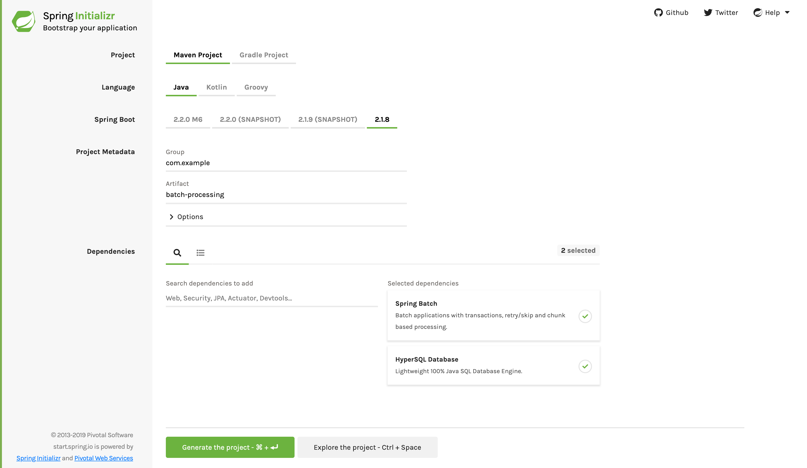

:spring_version: current
:spring_boot_version: 2.2.1.RELEASE
:Component: http://docs.spring.io/spring/docs/{spring_version}/javadoc-api/org/springframework/stereotype/Component.html
:SpringApplication: http://docs.spring.io/spring-boot/docs/{spring_boot_version}/api/org/springframework/boot/SpringApplication.html
:toc:
:icons: font
:source-highlighter: prettify
:project_id: gs-batch-processing

This guide walks you through the process of creating a basic batch-driven solution.

== What You Will build

You will build a service that imports data from a CSV spreadsheet, transforms it with custom code, and stores the final results in a database.

== What you'll need

:java_version: 1.8
include::https://raw.githubusercontent.com/spring-guides/getting-started-macros/master/prereq_editor_jdk_buildtools.adoc[]

include::https://raw.githubusercontent.com/spring-guides/getting-started-macros/master/how_to_complete_this_guide.adoc[]

== Business Data

Typically, your customer or a business analyst supplies a spreadsheet. For this simple
example, you can find some made-up data in `src/main/resources/sample-data.csv`:

====
[source,csv]
----
include::initial/src/main/resources/sample-data.csv[]
----
====

This spreadsheet contains a first name and a last name on each row, separated by a comma.
This is a fairly common pattern that Spring can handle without customization.

Next, you need to write an SQL script to create a table to store the data. You can find
such a script in `src/main/resources/schema-all.sql`:

====
[source,sql]
----
include::initial/src/main/resources/schema-all.sql[]
----
====

NOTE: Spring Boot runs `schema-@@platform@@.sql` automatically during startup. `-all` is the default for all platforms.

[[scratch]]
== Starting with Spring Initializr

For all Spring applications, you should start with the https://start.spring.io[Spring
Initializr]. The Initializr offers a fast way to pull in all the dependencies you need for
an application and does a lot of the set up for you. This example needs the Spring Batch
and HyperSQL Database dependencies. The following image shows the Initializr set up for
this sample project:

NOTE: The preceding image shows the Initializr with Maven chosen as the build tool. You
can also use Gradle. It also shows values of `com.example` and
`batch-processing` as the Group and Artifact, respectively. You will use those
values throughout the rest of this sample.

The following listing shows the `pom.xml` file created when you choose Maven:

====
[src,xml]
----
include::complete/pom.xml[]
----
====

The following listing shows the `build.gradle` file created when you choose Gradle:

====
[src,groovy]
----
include::complete/build.gradle[]
----
====

[[initial]]
== Create a Business Class

Now that you can see the format of data inputs and outputs, you can write code to
represent a row of data, as the following example (from
`src/main/java/com/example/batchprocessing/Person.java`) shows:

====
[source,java,tabsize=2]
----
include::complete/src/main/java/com/example/batchprocessing/Person.java[]
----
====

You can instantiate the `Person` class either with first and last name through a
constructor or by setting the properties.

== Create an Intermediate Processor

A common paradigm in batch processing is to ingest data, transform it, and then pipe it
out somewhere else. Here, you need to write a simple transformer that converts the names
to uppercase. The following listing (from
  `src/main/java/com/example/batchprocessing/PersonItemProcessor.java`) shows how to do
  so:

====
[source,java,tabsize=2]
----
include::complete/src/main/java/com/example/batchprocessing/PersonItemProcessor.java[]
----
====

`PersonItemProcessor` implements Spring Batch's `ItemProcessor` interface. This makes it
easy to wire the code into a batch job that you will define later in this guide. According
to the interface, you receive an incoming `Person` object, after which you transform it to
an upper-cased `Person`.

NOTE: The input and output types need not be the same. In fact, after one source of data
is read, sometimes the application's data flow needs a different data type.

== Put Together a Batch Job

Now you need to put together the actual batch job. Spring Batch provides many utility
classes that reduce the need to write custom code. Instead, you can focus on the business
logic.

To configure your job, you must first create a Spring `@Configuration` class like the following example in
`src/main/java/com/exampe/batchprocessing/BatchConfiguration.java`:

====
[source,java,tabsize=2]
----
include::complete/src/main/java/com/example/batchprocessing/BatchConfiguration.java[tag=setup]

    ...

}
----
====

For starters, the `@EnableBatchProcessing` annotation adds many critical beans that
support jobs and save you a lot of leg work. This example uses a memory-based database
(provided by `@EnableBatchProcessing`), meaning that, when it is done, the data is gone. It also autowires a couple factories needed further below.
Now add the following beans to your `BatchConfiguration` class to define a reader, a processor, and a writer:

====
[source,java,tabsize=2,indent=0]
----
include::complete/src/main/java/com/example/batchprocessing/BatchConfiguration.java[tag=readerwriterprocessor]
----
====

The first chunk of code defines the input, processor, and output.

* `reader()` creates an `ItemReader`. It looks for a file called `sample-data.csv` and
parses each line item with enough information to turn it into a `Person`.
* `processor()` creates an instance of the `PersonItemProcessor` that you defined earlier,
meant to converth the data to upper case.
* `write(DataSource)` creates an `ItemWriter`. This one is aimed at a JDBC destination and
automatically gets a copy of the dataSource created by `@EnableBatchProcessing`. It
includes the SQL statement needed to insert a single `Person`, driven by Java bean
properties.

The last chunk (from `src/main/java/com/example/batchprocessing/BatchConfiguration.java`)
shows the actual job configuration:

====
[source,java,tabsize=2,indent=0]
----
include::complete/src/main/java/com/example/batchprocessing/BatchConfiguration.java[tag=jobstep]
----
====

The first method defines the job, and the second one defines a single step. Jobs are built
from steps, where each step can involve a reader, a processor, and a writer.

In this job definition, you need an incrementer, because jobs use a database to maintain
execution state. You then list each step, (though this job has only one step). The job
ends, and the Java API produces a perfectly configured job.

In the step definition, you define how much data to write at a time. In this case, it
writes up to ten records at a time. Next, you configure the reader, processor, and writer
by using the beans injected earlier.

NOTE: `chunk()` is prefixed `<Person,Person>` because it is a generic method. This
represents the input and output types of each "`chunk`" of processing and lines up with
`ItemReader<Person>` and `ItemWriter<Person>`.

The last bit of batch configuration is a way to get notified when the job completes. The
following example (from
`src/main/java/com/example/batchprocessing/JobCompletionNotificationListener.java`) shows
such a class:

====
[source,java,tabsize=2]
----
include::/complete/src/main/java/com/example/batchprocessing/JobCompletionNotificationListener.java[]
----
====

The `JobCompletionNotificationListener` listens for when a job is `BatchStatus.COMPLETED`
and then uses `JdbcTemplate` to inspect the results.

== Make the Application Executable

Although batch processing can be embedded in web apps and WAR files, the simpler approach demonstrated below creates a standalone application. You package everything in a single, executable JAR file, driven by a good old Java `main()` method.

The Spring Initializr created an application class for you. For this simple example, it
works without further modification. The folowing listing (from
  `src/main/java/com/example/batchprocessing/BatchProcessingApplication.java`) shows the
  application class:

====
[source,java,tabsize=2]
----
include::complete/src/main/java/com/example/batchprocessing/BatchProcessingApplication.java[]
----
====

include::https://raw.githubusercontent.com/spring-guides/getting-started-macros/master/spring-boot-application-new-path.adoc[]

For demonstration purposes, there is code to create a `JdbcTemplate`, query the database,
and print out the names of people the batch job inserts.

include::https://raw.githubusercontent.com/spring-guides/getting-started-macros/master/build_an_executable_jar_subhead.adoc[]

include::https://raw.githubusercontent.com/spring-guides/getting-started-macros/master/build_an_executable_jar_with_both.adoc[]

The job prints out a line for each person that gets transformed. After the job runs, you
can also see the output from querying the database. It should resemble the following
output:

====
[source,text]
----
Converting (firstName: Jill, lastName: Doe) into (firstName: JILL, lastName: DOE)
Converting (firstName: Joe, lastName: Doe) into (firstName: JOE, lastName: DOE)
Converting (firstName: Justin, lastName: Doe) into (firstName: JUSTIN, lastName: DOE)
Converting (firstName: Jane, lastName: Doe) into (firstName: JANE, lastName: DOE)
Converting (firstName: John, lastName: Doe) into (firstName: JOHN, lastName: DOE)
Found <firstName: JILL, lastName: DOE> in the database.
Found <firstName: JOE, lastName: DOE> in the database.
Found <firstName: JUSTIN, lastName: DOE> in the database.
Found <firstName: JANE, lastName: DOE> in the database.
Found <firstName: JOHN, lastName: DOE> in the database.
----
====

== Summary

Congratulations! You built a batch job that ingested data from a spreadsheet, processed
it, and wrote it to a database.

== See also

The following guides may also be helpful:

* https://spring.io/guides/gs/spring-boot/[Building an Application with Spring Boot]
* https://spring.io/guides/gs/accessing-data-gemfire/[Accessing Data with GemFire]
* https://spring.io/guides/gs/accessing-data-jpa/[Accessing Data with JPA]
* https://spring.io/guides/gs/accessing-data-mongodb/[Accessing Data with MongoDB]
* https://spring.io/guides/gs/accessing-data-mysql/[Accessing data with MySQL]

include::https://raw.githubusercontent.com/spring-guides/getting-started-macros/master/footer.adoc[]
